# MacJu

#### 맥주 큐레이팅 SNS

#### 전체 일정

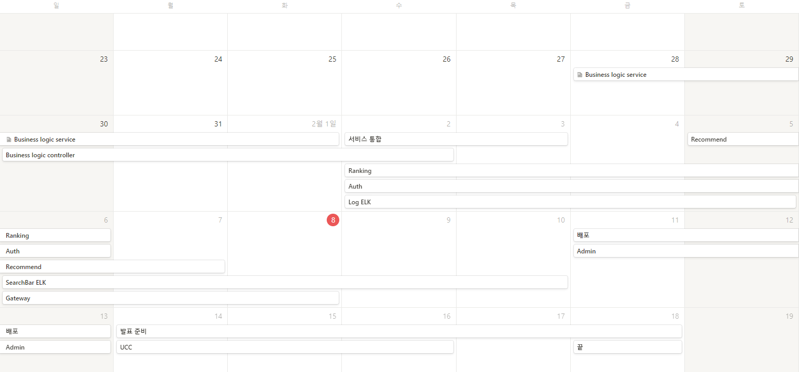

 

### BACKEND

#### URL

- 비즈니스 로직 서버

  - http://i6c107.p.ssafy.io:8080/swagger-ui/index.html

- 랭킹 서버

  - http://i6c107.p.ssafy.io:8081/swagger-ui/index.html

- Log ELK Kibana

  - http://i6c107.p.ssafy.io:5601/

- 시스템 아키텍처 진행 상황 반영한 버전

  - 초록색 : 구현 완료
  - 파란색 : 개발 진행 중

  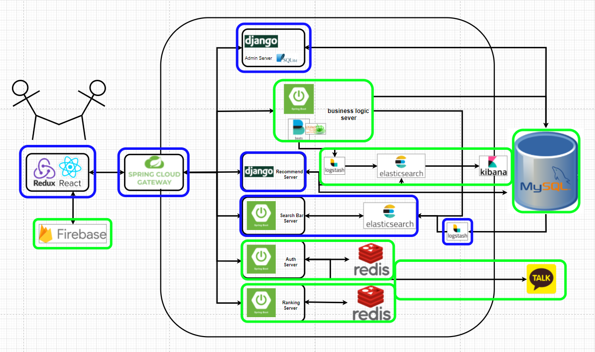

- Login 과정

  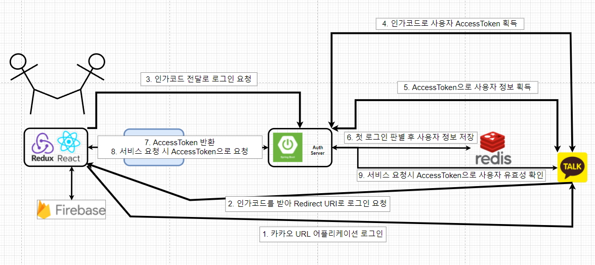

### FRONTEND

##### * url

## http://i6c107.p.ssafy.io:3000/

- 메인페이지
  - /home

- 포스트페이지

  - 생성 : /post/new

  - 상세페이지 : /post/:postId

  - 포스트수정 : /post/:postId/update

  - 포스트리스트 : /post

- 맥주페이지

  - 상세페이지 : /beer/:beerid

  - 맥주리스트 : /beer

- 로그인/회원가입

  - 로그인 : /user/login

  - 회원가입: /user/signup

- 프로필

  - 프로필 수정 : /profile/:userid/edit

  - 프로필 상세(포스트) : /profile/:userid/post

  - 프로필 상세(좋아요) : /profile/:userid/like

  - 프로필 상세(리뷰) : /profile/:userid/review
- 404error
  - /*
- firebase upload 이미지

##### * page photo

- Main

  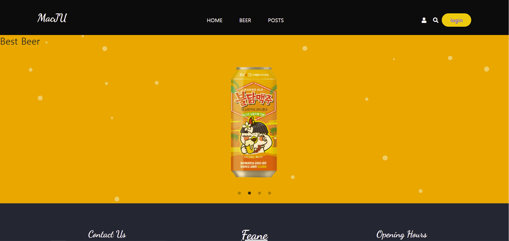

- BeerIndex

  

  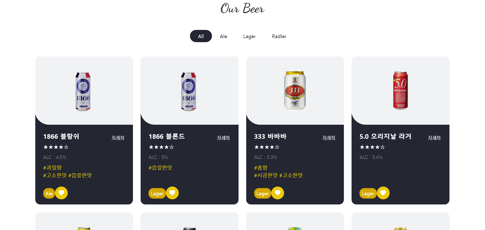

- BeerDetail

  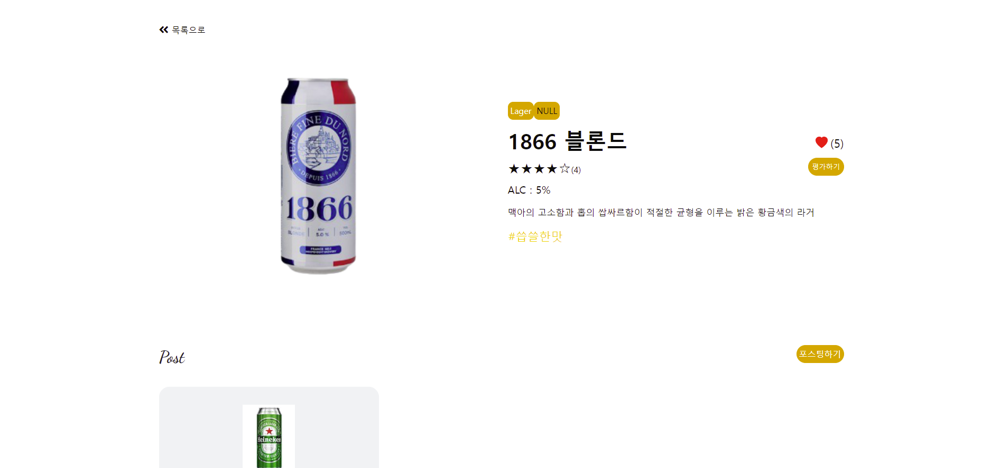

- PostIndex

  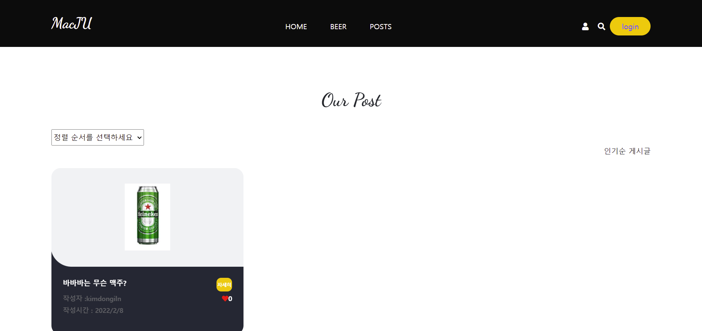

- PostDetail

  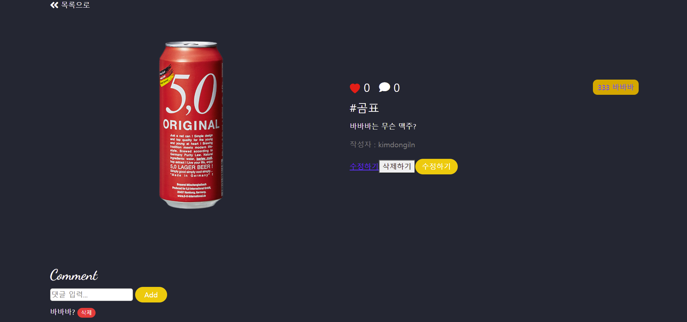

- ProfilePage

  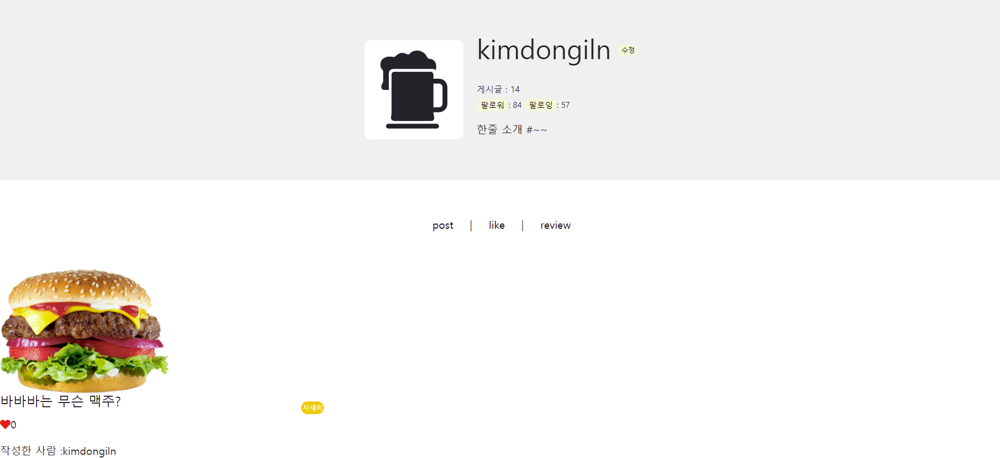

- Login

  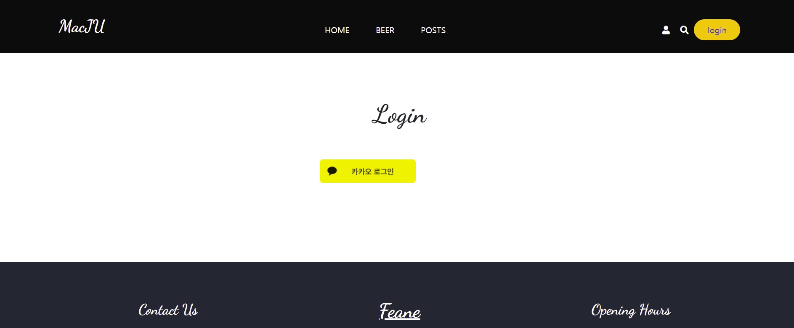

- 404Error

  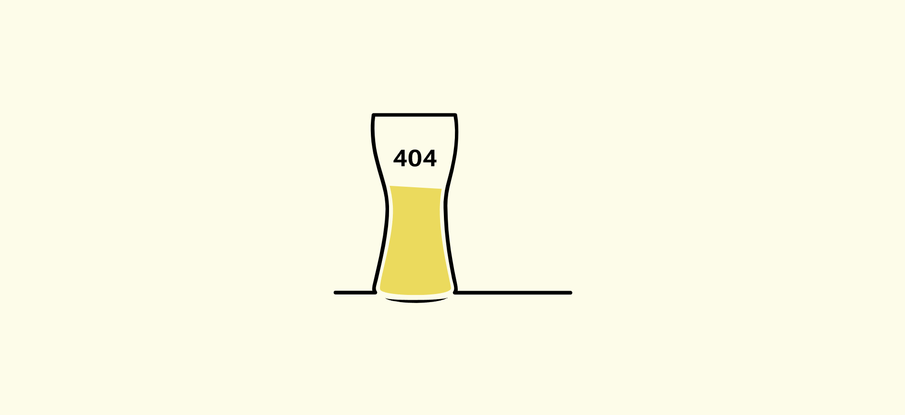

- firebase

